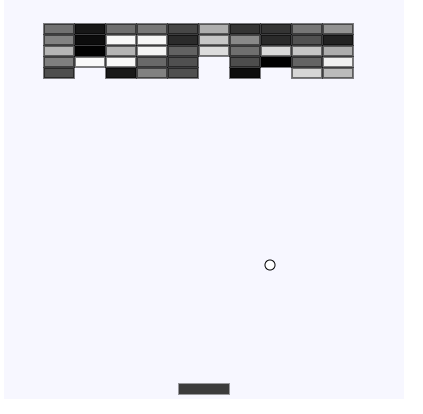

# Build a Breakout Game with js in a few lines of code

The purpose of this little tutorial is to get familiar with with an animation framework, thats work in the browser. My choise was to word with the [p5js](https://p5js.org/) library. Then i need thamething that i want to animate. Best way is to build a little game like pong, flappy bird, tetris, pacman, ...
in the following, i develop a little breakout game. 



## draw the elements

the playground includes a ball, a bar on the buttom and bricks on the top. the goal of the game is to destroy all bricks with the ball.

its very simple to start with p5js. first you need to include the library and a ```setup``` and a ```draw``` function.

```html
<!DOCTYPE html>
<html lang="en">
  <head>
    <meta charset="utf-8" />
    <meta http-equiv="X-UA-Compatible" content="IE=edge" />
    <meta name="viewport" content="width=device-width, initial-scale=1" />
    <title>p5 1x1</title>
  </head>
  <body>

    <script src="https://cdn.jsdelivr.net/npm/p5@1.8.0/lib/p5.js"></script>
    <script>
      function setup() {
        createCanvas(400, 400); //w,h
      }

      function draw() {
        background(247, 247, 255); //r,g,b
      }
    </script>
  </body>
</html>
```

The setup function is called when the library is loaded. Here we create a canvas with a resolution of 400x400px. in every iteraion, the engine calls the draw function (e.g. 50 calls per secound).
the first thing in the draw function is to override the canvas with a light blue color.

The bar on the buttom is a simple rectangle

```js
rect(200, 380, 50, 10);//x,y,w,h
```

The ball is a circle

```js
circle(200, 300, 10);//x,y, d
```

We need a loop to draw the bricks on the top of the ply ground

```js
const offsetX = 40;
const offsetY = 40;
for (let iX = 0; iX < 10; iX++) {
    for (let iY = 0; iY < 5; iY++) {
        rect(offsetX + iX * 31, offsetY + iY * 11, 30, 10);//x,y,w,h
    }
}
```

## control the bar

first we need a variable to store the position and the dimension.
```js
const bar = {
    h: 10,
    w: 50,
    y: 390, 
    x: 200
}
```

now we can draw the bar with the values from the object.
X and y are the coodinatas of the center of the bar.

```js
function drawBar(){
    rect(bar.x - (bar.w/2), bar.y - (bar.h/2), bar.w, bar.h);//x,y,w,h
}
```

p5js has functions to check if a key is pressed. we need ```keyIsDown(LEFT_ARROW)``` and ```keyIsDown(RIGHT_ARROW)``` to detect the left and right arrow keys. if the pressed, we update ```bar.x``` and add or substract 5px. If the bar leave the screen on the left side, we set the position so, that the left side of the bar touch the left end of the screen. Same on the right side

```js
function updateBar(){
    if (keyIsDown(LEFT_ARROW)) {
        bar.x -= 5;

        if((bar.x - (bar.w/2)) < 0){
        bar.x = bar.w/2;
        }
    }

    if (keyIsDown(RIGHT_ARROW)) {
        bar.x += 5;

        if((bar.x + (bar.w/2)) > 400){
        bar.x = 400 - bar.w/2;
        }
    }
}
```


## animate the ball

first we add variables to represent the balls dimension, postition and velocity. ALso we add a variable vor the canvas dimension, becouse we need this values on many places in the code and so it is better to change them later.

```js
const canvas = {
    w: 400,
    h: 400
}

const ball = {
    d: 10,
    x: 200, 
    y: 300,
    v: {dX: 1, dY: -1}, //speed (deltyX, deltaY)
}
```

the ball is animated when we add in each draw iteration a litte value to the x and the y coodinates of the ball

```js
function animateBall(){
    let newX = ball.x + ball.v.dX;
    let newY = ball.y + ball.v.dY;

    ball.x = newX;
    ball.y = newY;
}
```

Now the ball runs in one direction and leave the screen.

## detect collision with the walls

if the ball touch the left or right wall, then the speed on the x axis change the direction (multiplicate with -1).
When the top wall i touched when the speed on the y axis change the direction. the ball is positionate in the center of the play ground when he leave the play ground on the bottom.

```js
function animateBall(){
    let newX = ball.x + ball.v.dX;
    let newY = ball.y + ball.v.dY;

    const r = ball.d / 2;
    //right wall collision
    if(newX + r >= canvas.w){
        newX = (canvas.w - r);
        ball.v.dX *= -1; 
    }
    //left wall collision
    else if(newX - r <= 0){
        newX = 0 + r;
        ball.v.dX *= -1; 
    }
    //top wall collision
    if(newY - r <= 0){
        newY = 0 + r;
        ball.v.dY *= -1; 
    }
    //buttom wall collision
    else if(newY + r >= canvas.h){
        newY = (canvas.h/2 - r);
        newX = (canvas.w/2 - r);
        ball.v.dY = 1; 
        ball.v.dX = 1; 
    }

    ball.x = newX;
    ball.y = newY;
}
```

## detect collision with the bar

when the ball touch the bar, then he change his y axis speed.
```js
if(ball.y > bar.y){
    const barHalf = bar.w / 2;
    if(ball.x > (bar.x - barHalf) && ball.x < (bar.x + barHalf)){
        ball.v.dY *= -1;
        newY = bar.y;
    }
}
```

## detect collision with the bricks

first we need a variable with a array of the brick positions.

```js
const bricks = {
    w: 30,
    h: 10,
    positions: []
};
```

we initialisize the positions of the bricks in the setup function.

```js
function setup() {
    const offsetX = 55;
    const offsetY = 40;
    for (let iX = 0; iX < 10; iX++) {
        for (let iY = 0; iY < 5; iY++) {
            bricks.positions.push({
            x: offsetX + iX * 31,
            y:  offsetY + iY * 11
            });
        }
    }

    createCanvas(canvas.w, canvas.h);
}
```

then we draw the bricks from the array

```js
function drawBricks(){
    const xOffset = bricks.w / 2;
    const yOffset = bricks.h / 2;

    for (let idx = 0; idx < bricks.positions.length; idx++) {
        rect(
            bricks.positions[idx].x - xOffset, 
            bricks.positions[idx].y - xOffset, 
            bricks.w, 
            bricks.h);//x,y,w,h
    }
}
```

on collision of the ball with the brick. the ball change the direction an the brick is removed.

```js
...
        const bricksXOffset = bricks.w /2;
        const bricksYOffset = bricks.h /2;
        for (let idx = 0; idx < bricks.positions.length; idx++) {

          let p = bricks.positions[idx];
          if(ball.x > (p.x + bricksXOffset)){
            continue;
          }
          if(ball.x < (p.x - bricksXOffset)){
            continue;
          }
          if(ball.y > (p.y + bricksYOffset)){
            continue;
          }
          if(ball.y < (p.y - bricksYOffset)){
            continue;
          }

          //change speeed
          var cX = p.x - newX;
          var cY = p.y - newY;

          //collion right
          if(cX > bricks.w * 0.4){
              ball.v.dX *= -1; 
          }
          //collission left
          else if(abs(cX) > bricks.w * 0.4){
              ball.v.dX *= -1;
          }
          else if(cY > bricks.h * 0.3){
              ball.v.dY *= -1; 
          }
          //collission left
          else if(abs(cY) > bricks.h * 0.3){
              ball.v.dY *= -1;
          } else {
            ball.v.dY *=-1
            ball.v.dX *=-1
          }

          //remove brick
          bricks.positions.splice(idx, 1)
          break;
        }
...
```

## Summery

missing features: restart button, count the ball lost and play time, touch support for mobile devices, coloring styling, better collion detection on bricks, change speed on bar contact